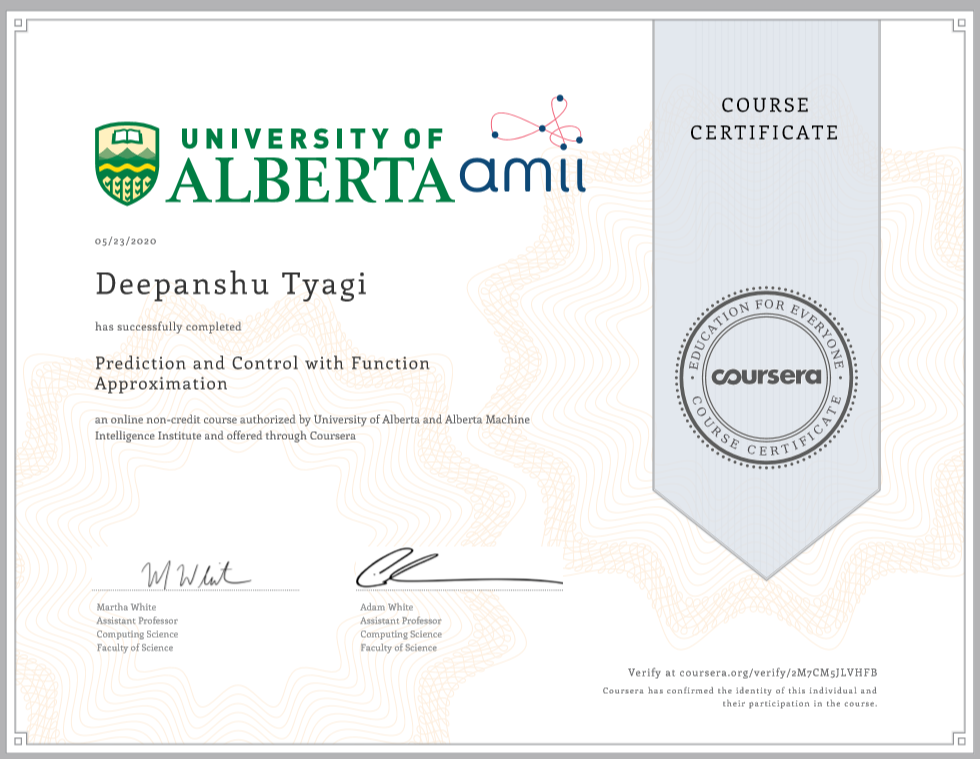

# Prediction and Control with Function Approximation

By the end of this course, you will be able to:

- Understand how to use supervised learning approaches to approximate value functions
- Understand objectives for prediction (value estimation) under function approximation
- Implement TD with function approximation (state aggregation), on an environment with an infinite state space (continuous state space)
- Understand fixed basis and neural network approaches to feature construction 
- Implement TD with neural network function approximation in a continuous state environment
- Understand new difficulties in exploration when moving to function approximation
- Contrast discounted problem formulations for control versus an average reward problem formulation
- Implement expected Sarsa and Q-learning with function approximation on a continuous state control task
- Understand objectives for directly estimating policies (policy gradient objectives)
- Implement a policy gradient method (called Actor-Critic) on a discrete state environment

## Week 1: On-policy Prediction with Approximation

This week you will learn how to estimate a value function for a given policy, when the number of states is much larger than the memory available to the agent. You will learn how to specify a parametric form of the value function, how to specify an objective function, and how estimating gradient descent can be used to estimate values from interaction with the world.

- Practice Quiz: [On-policy Prediction with Approximation](./Week_1/Practice_Quiz.pdf)
- Programming Assignment: [Semi-gradient TD(0) with State Aggregation](./Week_1/Assignment/C3M1_Assignment1-v8.ipynb)

## Week 2: Constructing Features for Prediction

The features used to construct the agent’s value estimates are perhaps the most crucial part of a successful learning system. In this module we discuss two basic strategies for constructing features: (1) fixed basis that form an exhaustive partition of the input, and (2) adapting the features while the agent interacts with the world via Neural Networks and Backpropagation. In this week’s graded assessment you will solve a simple but infinite state prediction task with a Neural Network and TD learning.

- Practice Quiz: [Constructing Features for Prediction](./Week_2/Practice_Quiz.pdf)
- Programming Assignment: [Semi-gradient TD with a Neural Network](./Week_2/Assignment/C3M2_Assignment2-v7.ipynb)

## Week 3: Control with Approximation

This week, you will see that the concepts and tools introduced in modules two and three allow straightforward extension of classic TD control methods to the function approximation setting. In particular, you will learn how to find the optimal policy in infinite-state MDPs by simply combining semi-gradient TD methods with generalized policy iteration, yielding classic control methods like Q-learning, and Sarsa. We conclude with a discussion of a new problem formulation for RL---average reward---which will undoubtedly be used in many applications of RL in the future.

- Practice Quiz: [Control with Approximation](./Week_3/Practice_Quiz.pdf)
- Programming Assignment: [Function Approximation and Control](./Week_3/Assignment/Assignment3-v3.ipynb)

## Week 4: Policy Gradient

Every algorithm you have learned about so far estimates a value function as an intermediate step towards the goal of finding an optimal policy. An alternative strategy is to directly learn the parameters of the policy. This week you will learn about these policy gradient methods, and their advantages over value-function based methods. You will also learn how policy gradient methods can be used to find the optimal policy in tasks with both continuous state and action spaces.

- Practice Quiz: [Policy Gradient Methods](./Week_4/Practice_Quiz.pdf)
- Programming Assignment: [Average Reward Softmax Actor-Critic using Tile-coding](./Week_4/Assignment/C3M4_Assignment4-v8.ipynb)

## Course Certificate

