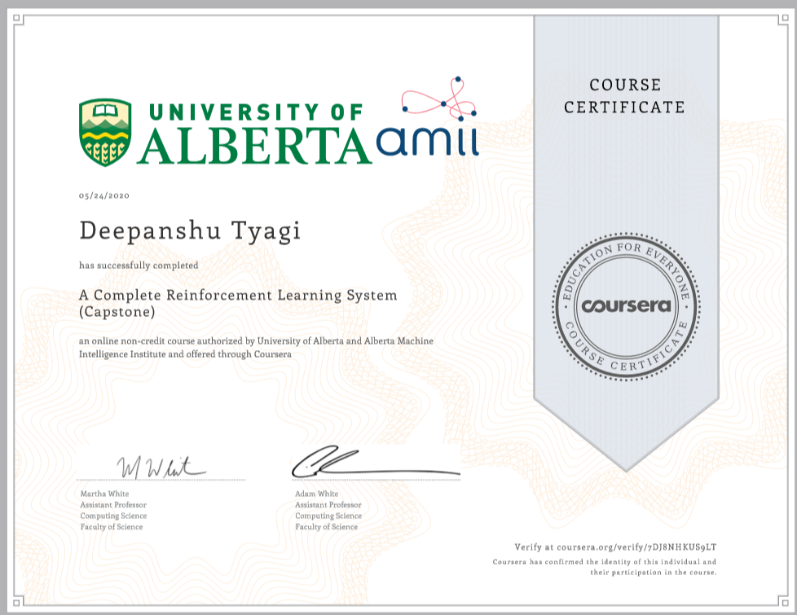

# A Complete Reinforcement Learning System (Capstone)

In this final course, you will put together your knowledge from Courses 1, 2 and 3 to implement a complete RL solution to a problem. This capstone will let you see how each component---problem formulation, algorithm selection, parameter selection and representation design---fits together into a complete solution, and how to make appropriate choices when deploying RL in the real world. This project will require you to implement both the environment to stimulate your problem, and a control agent with Neural Network function approximation. In addition, you will conduct a scientific study of your learning system to develop your ability to assess the robustness of RL agents. To use RL in the real world, it is critical to (a) appropriately formalize the problem as an MDP, (b) select appropriate algorithms, (c ) identify what choices in your implementation will have large impacts on performance and (d) validate the expected behaviour of your algorithms. This capstone is valuable for anyone who is planning on using RL to solve real problems.

## Week 1: Welcome to the Final Capstone Course

Welcome to the final capstone course of the Reinforcement Learning Specialization!!

## Week 2: Milestone 1: Formalize Word Problem as MDP

This week you will read a description of a problem, and translate it into an MDP. You will complete skeleton code for this environment, to obtain a complete MDP for use in this capstone project.

- Programming Assignment: [MoonShot Technologies](./Week_2/Assignment1-v2.ipynb)

## Week 3: Milestone 2: Choosing The Right Algorithm

This week you will select from three algorithms, to learn a policy for the environment. You will reflect on and discuss the appropriateness of each algorithm for this environment.

- Graded Quiz: [Choosing the Right Algorithm](./Week_3/Graded_Quiz.pdf)

## Week 4: Milestone 3: Identify Key Performance Parameters

This week you will identify key parameters that affect the performance of your agent. The goal is to understand the space of options, to later enable you to choose which parameter you will investigate in-depth for your agent.

- Graded Quiz: [Impact of Parameter Choices in RL](./Week_4/Graded_Quiz.pdf)

## Week 5: Milestone 4: Implement Your Agent

This week, you will implement your agent using Expected Sarsa or Q-learning with RMSProp and Neural Networks. To use NNs, you will have to use a more careful stepsize selection strategy, which is why you will use RMSProp. You will also verify the correctness of your agent.

- Programming Assignment: [Implement Your Agent](./Week_5/Course4ProgrammingAssignment2-v4.ipynb)

## Week 6: Milestone 5: Submit Your Parameter Study

This week you will identify a parameter to study, for your agent. Once you select the parameter to study, we will provide you with a range of values and specific values for other parameters. You will write a script to run your agent and environment on the set of parameters, to determine performance across these parameters. You will gain insight into the impact of parameters on agent performance. You will also get to visualize the agents that you learn. Your parameter study will consist of an array of values that we will check for correctness.

- Programming Assignment: [Completing the parameter study](./Week_6/C4M5_Assignment3-v9.ipynb)

## Course Certificate

